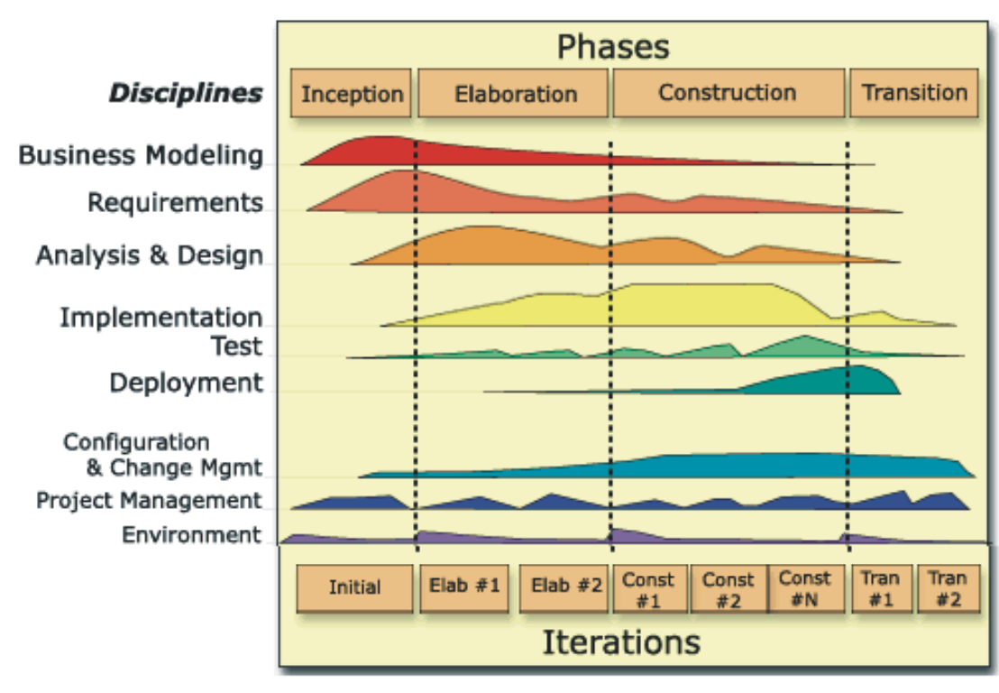
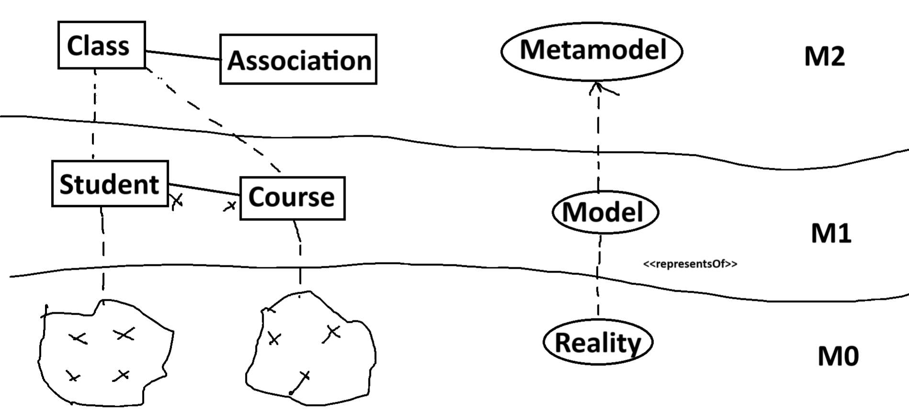

# Reuse (Design Patterns, Frameworks, ...)
# Components <-> Subsystems
# Traceability
Problem World <-> Design "Models" <-> Implementation
# Requirements
# Refinement
What(Specs) -> How(Design)
# Validation
Right product?

I mean some of the problems (cannot remember)

6 best practices:
- Develop interactively
  Lower risk than waterfall
- Manage requirements
   Analyze the Problem
   Understand User Needs
   Define the System
   Manage Scope
   Refine the System Definition
   Manage Changing Requirements
- Components architectures
  Reuseability
- Model visual (UML)
  Natural language <-> UML <-> programming language
  **Highlight details using zoom
  >Provides a standard UML language for all practitioners
  ## UML Diagrams
  Forward & Reverse engineering
- Continuously Verify Quality
  Test each iteration
- Manage change

Domain-specific modeling languges (DSMLs / DSLs)
  Σdomain = software?

# RUP (Cannot remember)

Four phases of RUP development:
- Inception - define the scope
- Elaboration: plan project
- Construction: Build product
- Transition: Transititon into end-user community

#### In OOAD we focus on: REQUIREMENTS & ANALYSIS

Ques: What is artifacts

UML Metamodel = {Meta Concepts} <-<<conformsTo>> UML Model

M3 là self loop

Google UML metamodel

UML Metamodel <-> Abstract syntax

So what exactly is a model? It is a simplication of reality

- Four principlpes of modeling